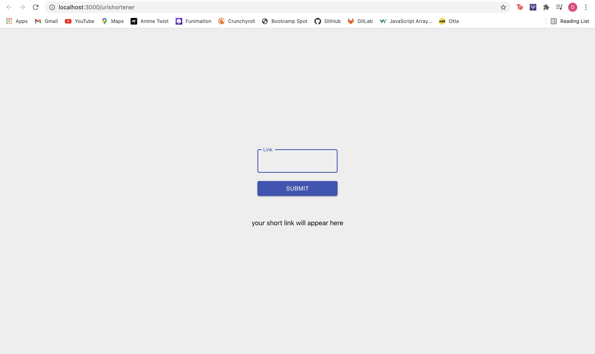

# URL Shortener

### What it does:

* URL Shortener allows users to enter a long URL and converts it into a short URL.

* The application has a URL validation to ensure only validated URLs are converted to short links 

## Technology Used

* React

* Axios

* Node.js 

* package.JSON

* gitignore

* Javascript

* ShrtCode API

* Material UI

## Screenshot of Application

## Links

* [GitHub repository](https://github.com/omaymaahmad/urlshortener) 

* [My GitHub](https://github.com/omaymaahmad)  

* My Email: <omayma.ahmad25@gmail.com>

